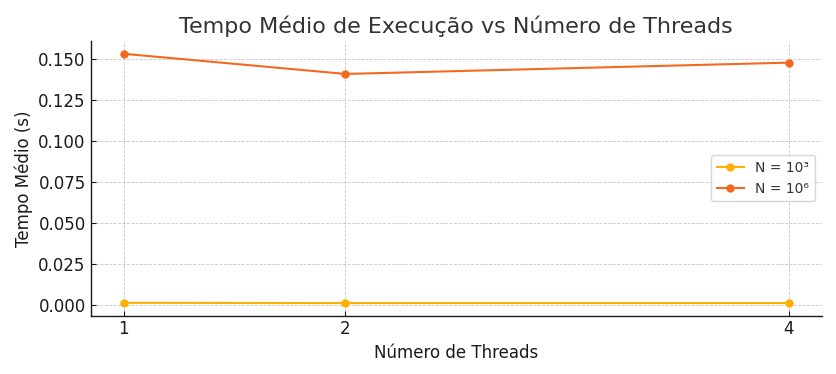
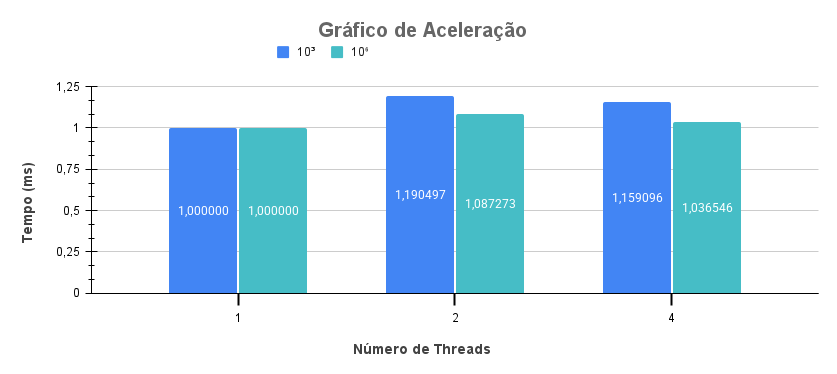
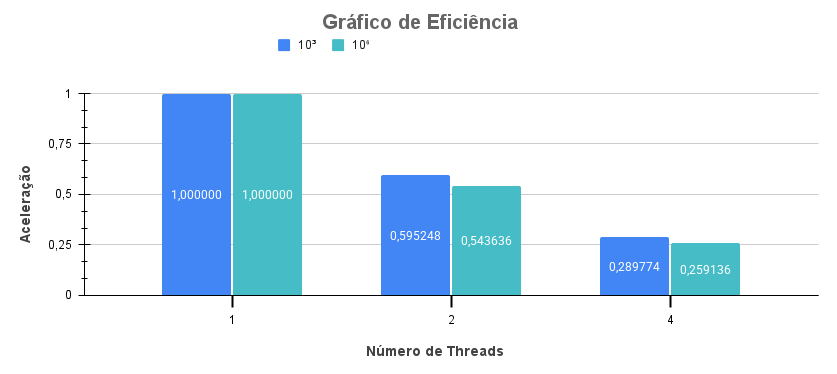

# Contagem de Números Primos com Concorrência


---

## Resultados Experimentais

### 💻 Configuração da Máquina
• Sistema Operacional: Linux Mint 21 Cinnamon

• Versão do Cinnamon: 5.4.12

• Kernel do Linux: 5.15.0-101-generic

• Processador: 13ª geração Intel® Core™ i5-13500, com 14 núcleos

---

### 🕒 Tempo de Execução (em segundos)

| Execução | Sequencial 10³ | Sequencial 10⁶ | 2 Threads 10³ | 2 Threads 10⁶ | 4 Threads 10³ | 4 Threads 10⁶ |
|----------|----------------|----------------|---------------|---------------|---------------|---------------|
| 1        | 0,001147       | 0,159272       | 0,000965      | 0,147073      | 0,000976      | 0,149484      |
| 2        | 0,001151       | 0,154895       | 0,000937      | 0,134918      | 0,000909      | 0,146371      |
| 3        | 0,001118       | 0,153576       | 0,000907      | 0,134212      | 0,000978      | 0,142024      |
| 4        | 0,001103       | 0,143698       | 0,001020      | 0,138497      | 0,000918      | 0,158695      |
| 5        | 0,001018       | 0,153314       | 0,000822      | 0,148670      | 0,000996      | 0,141218      |
| **Média**| **0,0011074**   | **0,152951**   | **0,0009302**  | **0,140674**  | **0,0009554**  | **0,147558**  |


### 📊 Gráfico Tempo de Execução (em segundos)



---

### ⚡ Aceleração

| N         | 1 Thread | 2 Threads| 4 Threads |
|-----------|----------|----------|-----------|
| 10³       | 1,00     | 1,190497 | 1,159096  |
| 10⁶       | 1,00     | 1,087273 | 1,036546  |

### 📊 Gráfico de Aceleração



---

### 📈 Eficiência

| N         | 1 Thread | 2 Threads | 4 Threads |
|-----------|----------|-----------|-----------|
| 10³       | 1,00     | 0,595248  | 0,289774  |
| 10⁶       | 1,00     | 0,543636  | 0,259136  |

### 📊 Gráfico de Eficiência



---

### Conclusão
Os resultados dos experimentos mostram que a implementação concorrente trouxe benefícios limitados, especialmente para valores pequenos de N, como 10³. Mesmo para N = 10⁶, onde o tempo de execução é mais significativo, a aceleração obtida foi modesta e a eficiência diminuiu com o aumento do número de threads.

## 🛠️ Compilação

```bash
gcc -o EhPrimo EhPrimo.c -lpthread -lm
